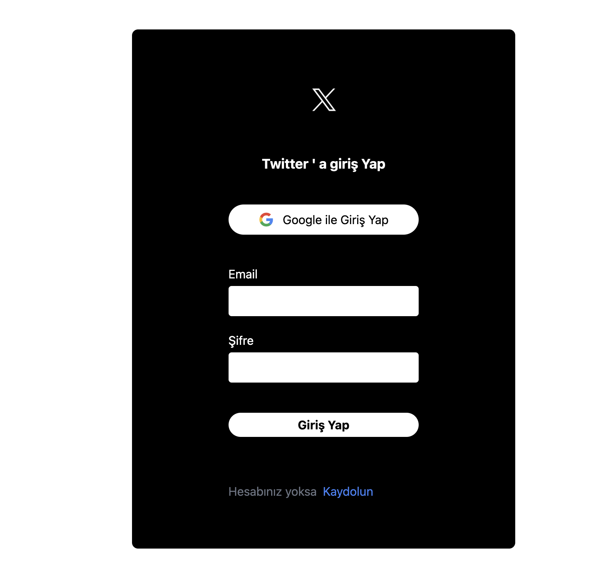
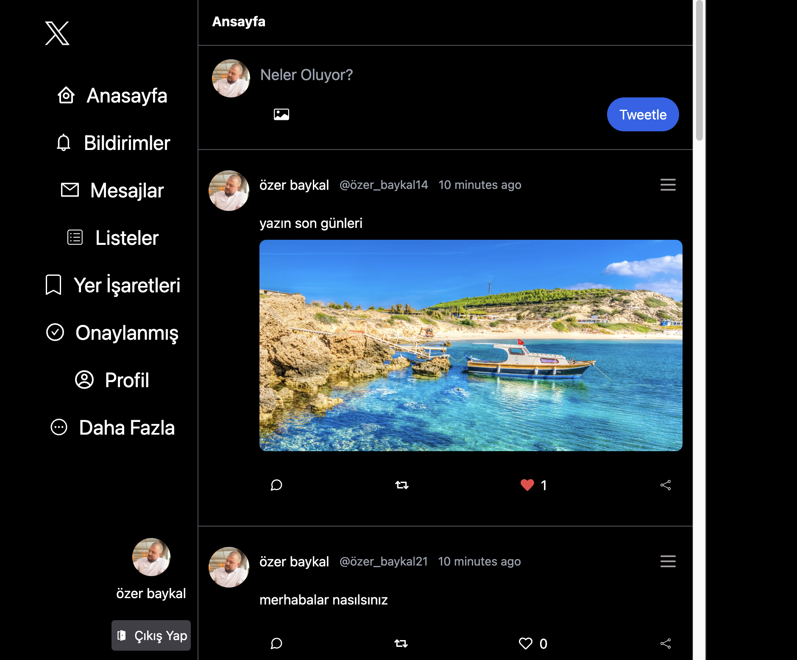

## Twitter Clone App


This project is a clone of Twitter, built using React and Firebase. The application allows users to sign in with their Google account and interact with tweets by posting, editing, liking, disliking, and uploading images. It integrates Firebase's powerful features such as authentication, Firestore database, and cloud storage.


<h2> Video gif</h2>


<h2>LoginPage</h2>



<h2>MainPage</h2>




## Table of Contents


- Introduction
- Features
- Technologies
- Installation
- Usage
- Contributing
- Contact


## Introduction
-The primary goal of this project is to demonstrate the effective use of Firebase for authentication,data management, and media storage. 
By integrating Firebase's database and storage features, the project manages the flow of data efficiently, such as handling user tweets, image uploads, and interactions (like/dislike).


## Features
- Google Authentication: Users can log in using their Google account via Firebase Authentication.
- Authorization: User roles are handled securely; restricted actions redirect users to appropriate UI prompts.
- Tweeting: Users can post tweets, edit them, and upload images.
- Like/Dislike: Users can like or dislike tweets in real time.
- Responsive UI: Integrated with Tailwind CSS for a clean, mobile-friendly design.
- Realtime updates: All tweet interactions and updates are reflected instantly via Firebase Firestore.

- Error Handling: User-friendly interface for handling incorrect login attempts or invalid inputs.

## Technologies 
The main technologies and libraries used in this project are:

- React: JavaScript library for building user interfaces
- React Router DOM: For client-side routing
-React Toastify: For displaying toast notifications
- React Icons: For icons in the user interface
- Moment.js: For date and time manipulation
- UUID: For generating unique IDs for tweets
- Firebase: Backend as a service, including:
   - Authentication: For secure user login and identity management
   - Firestore: A NoSQL cloud database for storing tweets
   - Storage: For handling media uploads such as images
-Tailwind CSS: Utility-first CSS framework for responsive and modern UI


 ##  Installation 

-  Clone the project to your local machine:
git clone https://github.com/ozerbaykal/tweetter-clone-app.git

- Navigate to the project directory:
```
cd toolkit-thunk-flight-radar
```
-  Install the dependencies :
```
npm install
```
### or
 ```
 yarn install

```
Set up Firebase :
  - Go to Firebase Console.
  - Create a new project and enable Google Authentication, Firestore, and Cloud Storage.
  - Get your Firebase config details from the project settings.
  - Create a .env file in the root directory and add your Firebase configuration:

 -  Create a .env file in the root directory and add your Firebase configuration:
 
 ```
 
REACT_APP_FIREBASE_API_KEY=your-api-key
REACT_APP_FIREBASE_AUTH_DOMAIN=your-auth-domain
REACT_APP_FIREBASE_PROJECT_ID=your-project-id
REACT_APP_FIREBASE_STORAGE_BUCKET=your-storage-bucket
REACT_APP_FIREBASE_MESSAGING_SENDER_ID=your-messaging-sender-id
REACT_APP_FIREBASE_APP_ID=your-app-id

```

## Usage

- Start the development server:
```
npm run dev
```
### or
```
yarn dev
```

<h2>Contributing</h2>

Contributions are welcome! Please open an issue first to discuss what you would like to change.

- 1.Fork the project 
- 2.Create your feature branch (git checkout -b feature/NewFeature)
- 3.Commit your changes (git commit -m 'Add new feature')
- 4.Push to the branch (git push origin feature/NewFeature)
- 5.Open a Pull Request


<h2>Contact</h2>


Özer BAYKAL  mail : baykalozer87@gmail.com

Project Link: https://github.com/ozerbaykal/toolkit-thunk-flight-radar